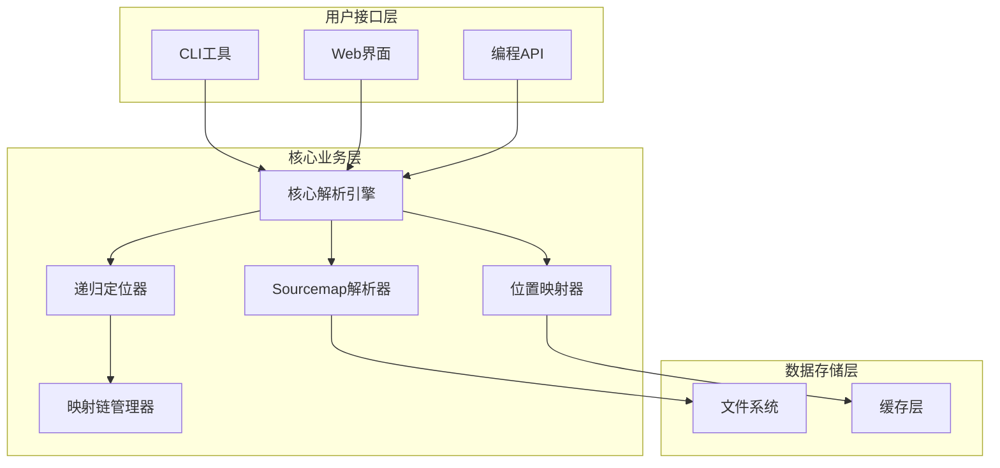
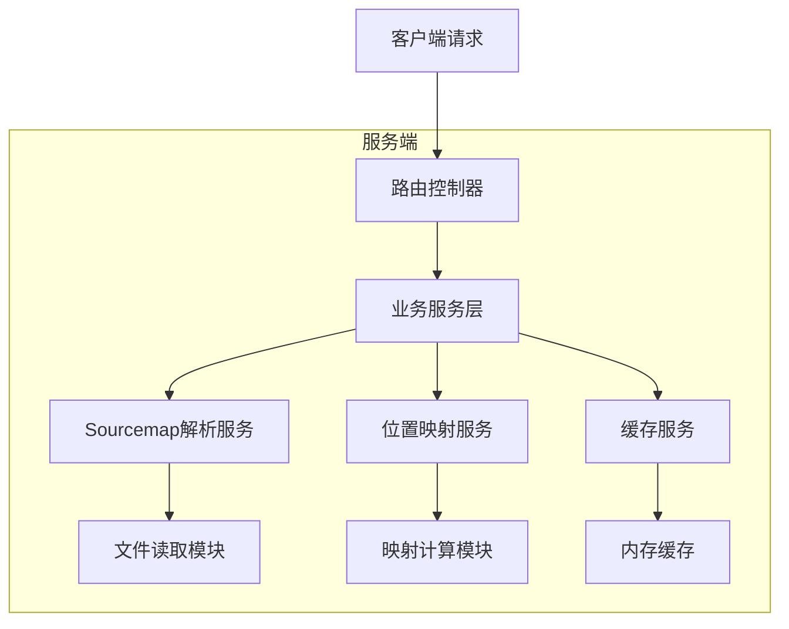
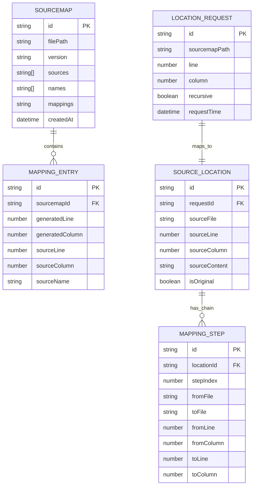

# Sourcemap定位器 - 技术架构文档

## 1. 架构设计



## 2. 技术描述

* 前端: React\@18 + TypeScript\@5 + Vite (Web界面)

* 后端: Node.js\@18 + TypeScript\@5

* 核心库: source-map\@0.7.4 + commander\@11 (CLI)

* 缓存: 内存缓存 + 可选Redis

* 打包: Rollup + esbuild

## 3. 路由定义

| 路由      | 用途                        |
| ------- | ------------------------- |
| /upload | 文件上传页面，支持sourcemap和代码文件上传 |
| /locate | 位置定位页面，输入行列号进行源码定位        |
| /result | 结果展示页面，显示定位结果和映射链路        |
| /api    | API文档页面，展示编程接口使用说明        |

## 4. API定义

### 4.1 核心API

**位置定位接口**

```
POST /api/locate
```

请求参数:

| 参数名           | 参数类型    | 是否必需  | 描述            |
| ------------- | ------- | ----- | ------------- |
| sourcemapPath | string  | true  | sourcemap文件路径 |
| line          | number  | true  | 目标行号(1-based) |
| column        | number  | true  | 目标列号(0-based) |
| recursive     | boolean | false | 是否递归解析多层映射    |

响应参数:

| 参数名          | 参数类型           | 描述     |
| ------------ | -------------- | ------ |
| success      | boolean        | 请求是否成功 |
| result       | SourceLocation | 定位结果信息 |
| mappingChain | MappingStep\[] | 映射链路信息 |

示例:

```json
{
  "sourcemapPath": "./dist/app.js.map",
  "line": 1,
  "column": 1234,
  "recursive": true
}
```

**批量定位接口**

```
POST /api/locate/batch
```

请求参数:

| 参数名       | 参数类型               | 是否必需 | 描述       |
| --------- | ------------------ | ---- | -------- |
| locations | LocationRequest\[] | true | 批量定位请求列表 |

**文件上传接口**

```
POST /api/upload
```

请求参数:

| 参数名  | 参数类型   | 是否必需 | 描述          |
| ---- | ------ | ---- | ----------- |
| file | File   | true | sourcemap文件 |
| type | string | true | 文件类型标识      |

## 5. 服务架构图



## 6. 数据模型

### 6.1 数据模型定义



### 6.2 TypeScript类型定义

```typescript
// 核心数据类型
interface SourceLocation {
  sourceFile: string;
  sourceLine: number;
  sourceColumn: number;
  sourceContent?: string;
  isOriginal: boolean;
}

interface MappingStep {
  stepIndex: number;
  fromFile: string;
  toFile: string;
  fromLine: number;
  fromColumn: number;
  toLine: number;
  toColumn: number;
}

interface LocationRequest {
  sourcemapPath: string;
  line: number;
  column: number;
  recursive?: boolean;
}

interface LocateResult {
  success: boolean;
  result?: SourceLocation;
  mappingChain?: MappingStep[];
  error?: string;
}

// Sourcemap文件结构
interface SourceMapData {
  version: number;
  sources: string[];
  names: string[];
  mappings: string;
  sourcesContent?: string[];
  sourceRoot?: string;
  file?: string;
}

// 缓存配置
interface CacheConfig {
  maxSize: number;
  ttl: number; // 缓存时间(秒)
  enableRedis?: boolean;
  redisUrl?: string;
}

// CLI配置
interface CLIOptions {
  sourcemap: string;
  line: number;
  column: number;
  recursive: boolean;
  output: 'json' | 'table' | 'raw';
  verbose: boolean;
}
```

