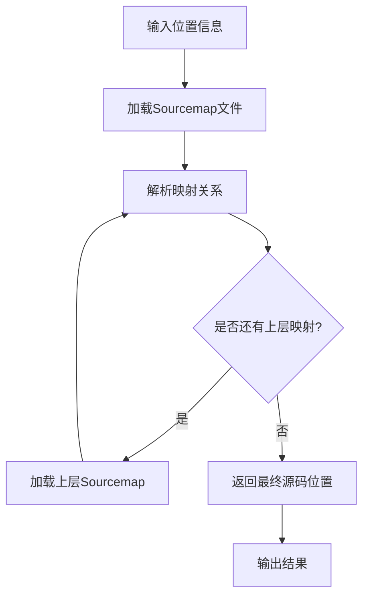

# Sourcemap定位器 - 产品需求文档

## 1. 产品概述

Sourcemap定位器是一个专业的开发工具，用于解析和定位JavaScript/TypeScript等前端代码的源码位置。支持多层sourcemap的递归解析，能够从压缩后的代码一直追溯到最原始的源代码位置。

- 解决前端开发中调试压缩代码困难的问题，帮助开发者快速定位错误源头
- 面向前端开发者、DevOps工程师和代码审查人员
- 提供精确的源码定位能力，大幅提升调试效率和问题排查速度

## 2. 核心功能

### 2.1 用户角色

| 角色 | 使用方式 | 核心权限 |
|------|----------|----------|
| 开发者 | CLI命令行或API调用 | 可使用所有定位功能，查看源码映射 |
| DevOps工程师 | 集成到CI/CD流程 | 可批量处理sourcemap，生成报告 |

### 2.2 功能模块

我们的sourcemap定位器包含以下主要功能：

1. **CLI命令行工具**: 交互式命令行界面，支持单次查询和批量处理
2. **编程API**: JavaScript/TypeScript API，支持集成到其他工具中
3. **Web界面**: 可选的Web UI，提供可视化的sourcemap解析和定位

### 2.3 页面详情

| 页面名称 | 模块名称 | 功能描述 |
|----------|----------|----------|
| CLI工具 | 命令解析器 | 解析命令行参数，支持文件路径、行列号输入 |
| CLI工具 | 结果输出器 | 格式化输出源码位置信息，支持多种输出格式 |
| API接口 | 核心解析引擎 | 解析sourcemap文件，执行位置映射计算 |
| API接口 | 递归定位器 | 支持多层sourcemap的递归解析，直到找到最终源码 |
| API接口 | 缓存管理器 | 缓存已解析的sourcemap，提升重复查询性能 |
| Web界面 | 文件上传区 | 上传sourcemap文件和目标代码文件 |
| Web界面 | 位置输入区 | 输入要定位的行号和列号信息 |
| Web界面 | 结果展示区 | 可视化展示源码定位结果和映射链路 |

## 3. 核心流程

**开发者使用流程：**
用户通过CLI工具输入压缩代码的位置信息 → 系统解析对应的sourcemap文件 → 递归查找多层映射关系 → 返回最终的源码位置和内容

**API集成流程：**
第三方工具调用API接口 → 传入sourcemap文件路径和位置信息 → 系统执行解析和定位 → 返回结构化的位置数据

## 4. 用户界面设计

### 4.1 设计风格

- **主色调**: 深蓝色 (#1e3a8a) 和浅灰色 (#f8fafc)
- **按钮样式**: 圆角矩形，带有轻微阴影效果
- **字体**: 等宽字体 Consolas/Monaco，代码区域使用 14px，界面文字使用 16px
- **布局风格**: 简洁的卡片式布局，左右分栏设计
- **图标风格**: 使用简洁的线性图标，支持代码、文件、定位等主题

### 4.2 页面设计概览

| 页面名称 | 模块名称 | UI元素 |
|----------|----------|--------|
| CLI工具 | 命令行界面 | 黑色背景，绿色文字，支持语法高亮和自动补全 |
| Web界面 | 文件上传区 | 拖拽上传组件，支持.map文件格式验证 |
| Web界面 | 位置输入区 | 数字输入框，实时验证行列号有效性 |
| Web界面 | 结果展示区 | 代码高亮显示，支持源码预览和跳转链接 |

### 4.3 响应式设计

Web界面采用桌面优先的响应式设计，支持移动端适配。CLI工具专注于终端环境的最佳体验，API接口无UI要求。