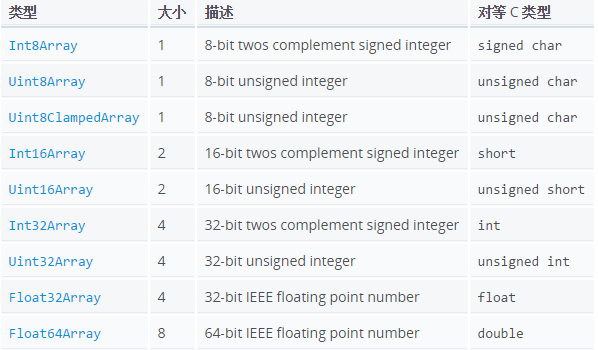

# 学习参考

## protobuf

- [深入 ProtoBuf - 简介](https://www.jianshu.com/p/a24c88c0526a)
- [深入 ProtoBuf - 编码](https://www.jianshu.com/p/73c9ed3a4877)
- [深入 ProtoBuf - 序列化源码解析](https://www.jianshu.com/p/62f0238beec8)
- [深入 ProtoBuf - 反射原理解析](https://www.jianshu.com/p/ddc1aaca3691)
- [图解protobuf的编码varints,zigzag与数据组织形式](https://juejin.cn/post/7267780768982908986)

### ProtoBuf 官方文档翻译

- [[翻译] ProtoBuf 官方文档（一）- 开发者指南](https://www.jianshu.com/p/bdd94a32fbd1)
- [[翻译] ProtoBuf 官方文档（二）- 语法指引（proto2）](https://www.jianshu.com/p/6f68fb2c7d19)
- [[翻译] ProtoBuf 官方文档（三）- 语法指引（proto3）](https://www.jianshu.com/p/fc7485af828d)
- [[翻译] ProtoBuf 官方文档（四）- 规范指引](https://www.jianshu.com/p/8c55fb0a09b5)
- [[翻译] ProtoBuf 官方文档（五）- 编码](https://www.jianshu.com/p/82ff31c6adc6)
- [[翻译] ProtoBuf 官方文档（六）- 相关技术](https://www.jianshu.com/p/d1d947d19c32)
- [[翻译] ProtoBuf 官方文档（七）- 第三方组件](https://www.jianshu.com/p/64b57684e1ab)
- [[翻译] ProtoBuf 官方文档（八）- （开发）教程](https://www.jianshu.com/p/ffc9a898552b)
- [[翻译] ProtoBuf 官方文档（九）- （C++开发）教程](https://www.jianshu.com/p/d2bed3614259)

## 反射技术

- [JavaScript利用反射实现方法注入](https://www.cnblogs.com/jiujiubashiyi/p/17578718.html)

## Canvas

- [GITHUB awesome-canvas](https://github.com/chinaBerg/awesome-canvas)
- [「干货」一份小白前端可视化学习指南——附思维导图](https://juejin.cn/post/6994169182216519710)
- [提高HTML5 canvas性能的几种方法！](https://blog.csdn.net/zyz511919766/article/details/7401792)
- [canvas 性能优化原理，加亿点点细节](https://blog.kuaitu.cc/2024/09/11/canvas%20%E6%80%A7%E8%83%BD%E4%BC%98%E5%8C%96%E5%8E%9F%E7%90%86%EF%BC%8C%E5%8A%A0%E4%BA%BF%E7%82%B9%E7%82%B9%E7%BB%86%E8%8A%82/)
- [2D Canvas 的渲染优化](https://www.cnblogs.com/tongbowen/articles/14925816.html)
- [游戏编程模式](https://gpp.tkchu.me/)

## WebGL

- [GLSL 中文手册](https://github.com/wshxbqq/GLSL-Card)
- [Web 中的 3D 游戏](https://developer.mozilla.org/zh-CN/docs/Games/Techniques/3D_on_the_web)
- [一次搞懂應用Shader(著色器)時所需知道的GLSL基本知識](https://umasss.medium.com/%E4%B8%80%E6%AC%A1%E6%90%9E%E6%87%82%E6%87%89%E7%94%A8shader-%E8%91%97%E8%89%B2%E5%99%A8-%E6%99%82%E6%89%80%E9%9C%80%E7%9F%A5%E9%81%93%E7%9A%84glsl%E5%9F%BA%E6%9C%AC%E7%9F%A5%E8%AD%98-fa1e4df6d33f)
- [Learning WebGL](https://learningwebgl.com/blog/?page_id=1217)
- [LearningWebGPU](https://github.com/hjlld/LearningWebGPU)

## 性能优化

- [手把手教你排查Javascript内存泄漏](https://zhuanlan.zhihu.com/p/322356761)
- [如何排查网页在哪里发生了内存泄漏？](https://cloud.tencent.com/developer/article/2197388)
- [一文带你了解如何排查内存泄漏导致的页面卡顿现象](https://xie.infoq.cn/article/aa6b0d97f38a1f8b98a61b024)
- [Canvas 最佳实践（性能篇](https://fed.taobao.org/blog/taofed/do71ct/canvas-performance)
- [Chrome DevTools - Performance Tab Summary](https://stackoverflow.com/questions/61922993/chrome-devtools-performance-tab-summary)
- [Performance使用指南前端性能排查](https://pengzhenglong.github.io/2023/03/31/Performance%E4%BD%BF%E7%94%A8%E6%8C%87%E5%8D%97%E5%89%8D%E7%AB%AF%E6%80%A7%E8%83%BD%E6%8E%92%E6%9F%A5/)
- [Chrome Devtool](https://developer.chrome.com/docs/devtools/overview?hl=zh-cn)

## 数据结构

- [N叉树](https://www.cnblogs.com/vincent1997/p/11194100.html)

## 二进制

- [掌握JavaScript中的二进制运算，提升你的编程技能](https://developer.aliyun.com/article/1511057)
- [JS 二进制详解](https://juejin.cn/post/6933152793721208845)
- [运算符](https://wangdoc.com/javascript/operators/)
- [ArrayBuffer简析](https://www.cnblogs.com/fuckgiser/p/5045234.html)

## SVGA

- [protobuf优缺点及编码原理](https://www.cnblogs.com/niuben/p/14212711.html)
- [SVGA文件优化指南：打造直播卡顿的终结者](https://wenku.csdn.net/column/8c0fbae9wi#1.%20SVGA%E6%96%87%E4%BB%B6%E4%BC%98%E5%8C%96%E7%9A%84%E5%9F%BA%E6%9C%AC%E6%A6%82%E5%BF%B5)

## 海报绘制思路

- [小程序canvas绘制海报全流程](https://developer.aliyun.com/article/1259392)

## VIDEO

- [如何一步步抽出双端通用Video组件(Taro小程序/h5)](https://juejin.cn/post/7413541435331084351)
- [HTML 音频/视频 DOM loadedmetadata 事件（保姆级教程）](https://www.exception.site/article/3489)
- [什么是元数据（Metadata）?](https://zhuanlan.zhihu.com/p/101001989)

## 问题汇总

- [#127 Generate js file from proto file with protoc](https://github.com/protocolbuffers/protobuf-javascript/issues/127#issuecomment-1204202870)
